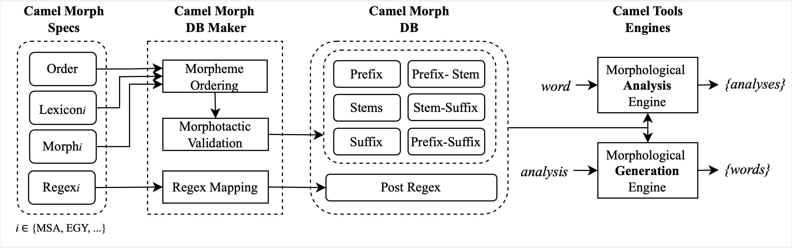

# Camel Morph

The work presented in this repository is part of a large effort on Arabic morphology under the name of the Camel Morph Project [^2]. Camel Morph’s goal is to build large open-source morphological models for Arabic and its dialects across many genres and domains. This repository contains code meant to build an ALMOR-style database (DB) from a set of morphological specification and lexicon spreadsheets, which can then be used by [Camel Tools](https://github.com/CAMeL-Lab/camel_tools)’s for morphological analysis, generation, and reinflection.

<p align="center">  </p>

The following sections provide useful usage information about the repository. For pointers to the system used for the SIGMORPHON 2022 Camel Morph paper, check the [Camel Morph SIGMORPHON 2022](#camel-morph-sigmorphon-2022) section.

## Camel Morph SIGMORPHON 2022

This section guides you through the process of inspecting, making use of, and replicating the results obtained for the SIGMORPHON 2022 Camel Morph paper[^2]. Firstly, all the data can be obtained or viewed as described in the [Data](#data) section. However, all the data and code (including relevant Camel Tools modules) required to replicate the paper results are already contained in the standalone `./sigmorphon2022_release` directory. The main goal of the Camel Morph DB Maker is to generate a database which can be parsed by the Camel Tools DB reader that can in turn be used by its Analyzer and Generator engines[^3]. To replicate the paper results, follow the below instructions. For a fuller picture of all configurations, see the [Instructions](#instructions) section.

### Installation

1. Clone (download) this repository and unzip in a directory of your choice.
2. Make sure that the following are installed using `pip install`: **Python 3.3** or newer, **NumPy 1.20** or newer, and **Pandas 1.4** or newer.
3. Run all commands/scripts from the `sigmorphon2022_release` directory.

### Modern Standard Arabic (MSA) Results

To generate the MSA verbs database, the results of which were described in the paper[^2], run the following two commands from the main repository directory to output the resulting DB (`msa_cam_ready_sigmorphon2022_v1.0.db`) into the `sigmorphon2022_release/databases/camel-morph-msa` directory:

    >> cd sigmorphon2022_release
    >> python db_maker.py -config_file config.json -config_name msa_cam_ready_sigmorphon2022 

### Egyptian Arabic (EGY) Results

To generate the EGY verbs database, the results of which were described in the paper[^2], run the following two commands from the main repository directory to output the resulting DB (`egy_cam_ready_sigmorphon2022_v1.0.db`) into the `sigmorphon2022_release/databases/camel-morph-egy` directory:

    >> cd sigmorphon2022_release
    >> python db_maker.py -config_file config.json -config_name egy_cam_ready_sigmorphon2022

### Analysis and Generation

In order to use the generated DB for analysis or generation, follow the same instructions provided in the examples at the following links. Note that there is no need to install Camel Tools as all the needed modules are already contained in the `sigmorphon2022_release` directory. As long as all code is ran from inside the latter directory, then all behavior should be similar to actually using the official library:

- [Analysis](https://camel-tools.readthedocs.io/en/latest/api/morphology/analyzer.html)
  - [Disambiguation](https://camel-tools.readthedocs.io/en/latest/api/disambig/mle.html) (in-context analysis)
- [Generation](https://camel-tools.readthedocs.io/en/latest/api/morphology/generator.html)


## Data

The data throughout this project is being maintained through the Google Sheets interface which can be used to add, delete, or edit morphological specification entries. The following are links to the data and morphological specifications used for this project.

### Continuously Updated Data

- [MSA Verbs Specifications](https://docs.google.com/spreadsheets/d/1thVU-IP-I-XnOmy5XfdUr39eNgDldZfMeTI75EH1TjQ/edit?usp=sharing)
- [EGY Verbs Specifications](https://docs.google.com/spreadsheets/d/1NBK_UPl2799GRBkOrd9Eub_yLn2U2ccbJqYETKdCcbw/edit?usp=sharing)

### SIGMORPHON 2022 Data (frozen)

- [MSA Verbs Specifications (Camera Ready)](https://docs.google.com/spreadsheets/d/1v9idxctnr6IsqG4c7bHs7lGx7GzbnTa2s4ghQCmLoPY/edit#gid=524706154)
- [EGY Verbs Specifications (Camera Ready)](https://docs.google.com/spreadsheets/d/1OCqHIdeZpm9BNa-BiC7Xy6bAT_wkLnhuvKdo7X3-RtE/edit#gid=424095452)

## Folder Hierarchy

| Directory | Description |
| ----------- | ----------- |
| `./camel_morph` | Python package containing all the necessary files to build, debug, test, and evaluate. |
| `./configs` | Contains configuration files which make running the scripts in the above directory easier.
| `./data` | Contains, for each different configuration, the set of morphological specification files necessary to run the different scripts.
| `./databases` | Contains the output DB files resulting from the DB Making process.
|`./debugging_output` | Contains all DB debugging files which are usually uploaded (automatically) to and analyzed in Google Sheets.
| `./eval_files` | Contains files necessary to carry out evalutation of generated DBs and analyzable evaluation output files (generally analyzed on Google Sheets).
| `./misc_files` | Contains miscellaneous files used by scripts inside `./camel_morph`.
| `./sandbox` | Contains various standalone files that are not used in `./camel_morph`.
| `./sigmorphon2022_release` | Standalone environment allowing users to run the DB Maker and Camel Tools engine without installing Camel Tools, in the same version used for the SIGMORPHON 2022 paper. Also contains the data that was used to get the results described in the paper[^2].

## Instructions

To generate databases, paradigm-specific inflection (conjugation/declension) tables, or evaluation tables, follow the below instructions. Note that the adjoining `Makefile` can be used to reproduce the experiments which were ran in-house by providing the (pipelines of) instructions that were used to carry them out. But first, it is important to understand the structure of the configuration file. Also, a default configuration file is included in the `./configs` directory for direct usage.

### Installation

To start working with the Camel Morph environment:

1. Clone (download) this repository and unzip in a directory of your choice.
2. Clone (download) a [fork](https://github.com/christios/camel_tools) of the Camel Tools repository. The Camel Morph databases will currently only function using the latter instance of Camel Tools. The changes in this fork will eventually be integrated to the main Camel Tools library. Unzip in a directory of your choice.
3. Make sure that the following are installed using `pip install`: **Python 3.3** or newer, **NumPy 1.20** or newer, and **Pandas 1.4** or newer.
4. Set the `CAMEL_TOOLS_PATH` value to the path of the Camel Tools fork repository in the configuration file that you will be using (default configuration file `./configs/config_default.json` provided; see [Configuration File Structure](#configuration-file-structure) section).
5. Run all commands/scripts from the outer `camel_morph` directory.

For instructions on how to run the different scripts, see the below sections.

### Compiling a Database (DB Maker)

The below command compiles an ALMOR-style database starting from a set of morphological specification files referenced in the specific configuration mentioned as an argument.

#### Usage

```bash
usage: db_maker.py [-h] [-config_file CONFIG_FILE]
                   [-config_name CONFIG_NAME]
                   [-output_dir OUTPUT_DIR]
                   [-run_profiling]
                   [-camel_tools {local,official}]
```

#### Arguments

|short|default|help|
| :--- | :--- | :--- |
|`-config_file`|`config_default.json`|Path of the configuration file which contains different configurations to run the DB on. Some pre-compiled configurations already exist in `./configs/config.json`, but new ones could be easily added. See [here](#configuration-file-structure) for an overview of the configuration file format. Defaults to `./configs/config_default.json`.|
|`-config_name`|`default_config`|Configuration name of one of the configurations contained in `CONFIG_FILE`. It contains script parameters, sheet paths, etc.|
|`-output_dir`||Overrides path of the directory to output the DBs to (specified in the global section of `CONFIG_FILE`).|
|`-run_profiling`||To generate an execution time profile of the specific configuration.|
|`-camel_tools`|`local`|Path of directory containing the CAMeL Tools modules (should be cloned as described [here](#installation-1)).|

### Configuration File Structure

In its most basic format, the configuration file should look like the example below in order to successfully run the scripts described in this guide.

#### Default Configuration File

    {
        "global": {
            "data_dir": "DATA_DIR_PATH",
            "specs": {
                "sheets": [
                    "ABOUT_SHEET",
                    "HEADER_SHEET"
                ]
            },
            "db_dir": "DB_OUTPUT_DIR",
            "camel_tools": "CAMEL_TOOLS_PATH"
        },
        "local": {
            "CONFIG_NAME": {
                "dialect": "DIALECT",
                "cat2id": CAT2ID,
                "pruning": PRUNING,
                "specs": {
                    "sheets": {
                        "order": "ORDER_SHEET",
                        "morph": "MORPH_SHEET"
                    }
                },
                "lexicon": {
                    "sheets": [
                        "LEX_SHEET_1",
                        ...
                    ]
                },
                "db": "DB_NAME",
                "pos_type": "POS_TYPE"
            }
        }
    }

where:

- `DATA_DIR_PATH`: path of the outermost data directory where all sheets are kept referenced from the outermost `camel_morph` directory (e.g., `data`)
- `ABOUT_SHEET`: name of the sheet containing the *About* section which will go in the DB (e.g., `About`). Downloaded as specified in the [Google Sheets](#google-sheets) section.
- `HEADER_SHEET`: same as `ABOUT_SHEET` (e.g., `Header`)
- `DB_OUTPUT_DIR`: name of the directory to which the compiled DBs will be output.
- `CAMEL_TOOLS_PATH`: path of the Camel Tools repository fork that should be cloned/downloaded as described in [Installation](#installation) section.
- `CONFIG_NAME`: name of the configuration in the `local` section of the config file, to choose between a number of different configurations (e.g., `default_config`). This is also the name of the folder which contains the sheets that are specified for that configuration and the global section.
- `DIALECT`: dialect being worked with (i.e., `msa` or `egy`). This is specified to further organize the configuration-specific data into high-level projects (i.e., `./data/camel-morph-msa` or `./data/camel-morph-egy`).
- `CAT2ID`: boolean (`true` or `false`). Specifies the format in which to output the category names. If set to true, then category names are IDs, otherwise, they contain condition information.
- `PRUNING`: boolean (`true` or `false`). Used in the DB making process to speed up DB compilation. For this to be set to `true`, the Morph sheet must contain condition definitions (organization of conditions into categories).
- `ORDER_SHEET`: same as `ABOUT_SHEET` (e.g., `MSA-Verb-ORDER`).
- `MORPH_SHEET`: same as `ABOUT_SHEET` (e.g., `MSA-Verb-MORPH`).
- `LEX_SHEET_1`: same as `ABOUT_SHEET` (e.g., `MSA-Verb-LEX-PV`). At least one lexicon sheet can be specified; the latter will be concatenated in pre-processing.
- `DB_NAME`: name of the output DB.
- `POS_TYPE`: type of the POS for which we are building the DB. Can either be `verbal` or `nominal`.

[^2]: Habash, Nizar et al. "Morphotactic Modeling in an Open-source Multi-dialectal Arabic Morphological Analyzer and Generator", SIGMORPHON. 2022
[^3]: Note that for the release directory, only the morphological components from Camel Tools were sourced from the actual library and were added to be imported locally.
